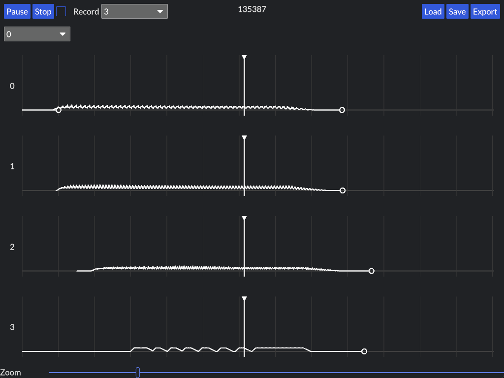

# operator

Operator is a fun audio sketchpad, focused on a fast, keyboard-centric workflow and playful UI. It is currently an incomplete prototype with only a few of these features.

Synth engines are written in [Faust](https://faust.grame.fr/), are played using the keyboard, and can be recorded to 4 audio tracks.

